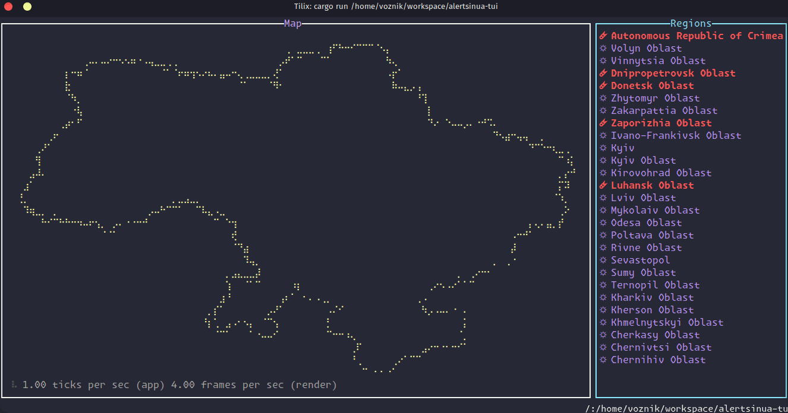

# ralertsinua

<p>Rust async API wrapper (<em>reqwest</em>) & <abbr title="Terminal User Interface">TUI</abbr> (<em>ratatui</em>) for <u>alerts.in.ua</u>



#

## Introduction
The Alerts.in.ua API Client is a Rust library that simplifies access to the alerts.in.ua API service. It provides real-time information about air raid alerts and other potential threats.


## Installation
To install the Alerts.in.ua API Client, run the following command in your terminal:

```bash
cargo add ralertsinua
```

## Usage

⚠️ Before you can use this library, you need to obtain an API token by submitting an [API request form](https://alerts.in.ua/api-request).

Here's an basic example of how to use the library to get a list of active alerts:

Async:
```rust
use ralertsinua_http::{AlertsInUaClient, API_BASE_URL}

#[tokio::main]
async fn main() -> Result<()> {
    # Initialize the client with your token
    alerts_client = AlertsInUaClient(API_BASE_URL, "your_token");

    # Get the active alerts
    active_alerts = await alerts_client.get_active_alerts();

    print!("active_alerts: {}", active_alerts.into());
}
```

<!--
```
or sync:
```rust
use ralertsinua_http::AlertsInUaClient

alerts_client = AlertsClient(token="your_token")

## Get the active alerts
active_alerts = alerts_client.get_active_alerts()
print(active_alerts)
```
-->

## Alerts

Alerts class is a collection of alerts and provides various methods to filter and access these alerts.

When user call `client.get_active_alerts()` it returns `Alerts` class.
## Methods

### filter(*args: str) -> Vec<Alert>
This method filters the alerts based on the given parameters.

```rust
filtered_alerts = active_alerts.filter('location_oblast', 'Донецька область','alert_type','air_raid')
```
In this example, filtered_alerts will contain all the air raid alerts that have the location oblast as 'Донецька область'.

### get_alerts_by_location_title(location_title: str) -> Vec<Alert>
This method returns all the alerts from specified location.

```rust
kyiv_alerts = active_alerts.get_alerts_by_location_title('м. Київ')
```

### get_air_raid_alerts() -> Vec<Alert>
This method returns all the alerts that are of alert type 'air_raid'.
```rust
air_raid_alerts = active_alerts.get_air_raid_alerts()
```

### get_oblast_alerts() -> Vec<Alert>
This method returns all the alerts that are of location type 'oblast'.

```rust
oblast_alerts = active_alerts.get_oblast_alerts()
```

### get_raion_alerts() -> Vec<Alert>
This method returns all the alerts that are of location type 'raion'.
```rust
raion_alerts = active_alerts.get_raion_alerts()
```

### get_hromada_alerts() -> Vec<Alert>
This method returns all the alerts that are of location type 'hromada'.
```rust
hromada_alerts = active_alerts.get_hromada_alerts()
```

### get_city_alerts() -> Vec<Alert>
This method returns all the alerts that are of location type 'city'.

```rust
city_alerts = active_alerts.get_city_alerts()
```

### get_alerts_by_alert_type(alert_type: str) -> Vec<Alert>
This method returns all the alerts that are of the given alert type.

```rust
artillery_shelling_alerts = active_alerts.get_alerts_by_alert_type('artillery_shelling')
```

### get_alerts_by_location_type(location_type: str) -> Vec<Alert>
This method returns all the alerts that are of the given location type.

```rust
urban_location_alerts = active_alerts.get_alerts_by_location_type('raion')
```

### get_alerts_by_oblast(oblast_title: str) -> Vec<Alert>
This method returns all the alerts that are of the given oblast title.

```rust
donetsk_oblast_alerts = active_alerts.get_alerts_by_oblast('Донецька область')
```

### get_alerts_by_location_uid(location_uid: str) -> Vec<Alert>
This method returns all the alerts that have the given location uid.
```rust
location_uid_alerts = active_alerts.get_alerts_by_location_uid('123456')
```

### get_artillery_shelling_alerts() -> Vec<Alert>
This method returns all the alerts that are of alert type 'artillery_shelling'.
```rust
artillery_shelling_alerts = active_alerts.get_artillery_shelling_alerts()
```

### get_urban_fights_alerts() -> Vec<Alert>
This method returns all the alerts that are of alert type 'urban_fights'.
```rust
urban_fights_alerts = active_alerts.get_urban_fights_alerts()
```

### get_nuclear_alerts() -> Vec<Alert>
This method returns all the alerts that are of alert type 'nuclear'.
```rust
nuclear_alerts = active_alerts.get_nuclear_alerts()
```

### get_chemical_alerts() -> Vec<Alert>
This method returns all the alerts that are of alert type 'chemical'.
```rust
chemical_alerts = active_alerts.get_chemical_alerts()
```

### get_all_alerts() -> Vec<Alert>
This method returns all alerts.
```rust
all_alerts = active_alerts.get_all_alerts()
```
or you can use shortcut:
```rust
for alert in active_alerts:
    print!(alert)
```
### get_last_updated_at() -> datetime.datetime
This method returns the datetime object representing the time when the alert information was last updated (Kyiv timezone).
```rust
last_updated_at = alerts.get_last_updated_at()
```

### get_disclaimer() -> str
This method returns the disclaimer associated with the alert information.
```rust
disclaimer = alerts.get_disclaimer()
```

## License
MIT 2024

*[TUI]: Terminal User Interface
